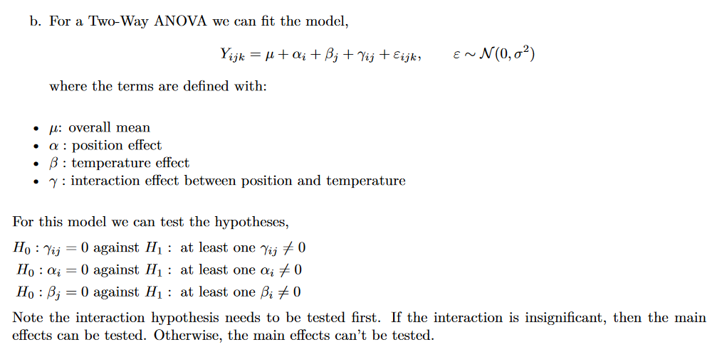

```{r setup, include=FALSE}
knitr::opts_chunk$set(echo = TRUE)
```

# Part 1
## Question 1
### a
```{r}
dens <- read.csv("SGTADATASETS/density.csv", header = TRUE)

with(dens, interaction.plot(position, temp, density, col=1:3))
with(dens, interaction.plot(temp, position, density, col = 1:2, lwd = 2))

table(dens[, c("position", "temp")])
```
- No obvious interaction between position and temp since the lines are near parallel across the levels of each
factor. 
- The design is balanced and there are only 3 observations per combination of levels. 
So there is likely little to no evidence of interaction and we are only finding variation in the data that we would expect to see
with no interaction.

### b


### c
```{r}
dens.int <- lm(density ~ factor(temp) * factor(position), data = dens)
anova(dens.int)
```
Evidently interaction is insignificant. 

```{r}
dens.main <- lm(density ~ factor(temp) + factor(position), data = dens)
anova(dens.main)
```
From the above we can reject both the hypotheses that the main effects are insignificant. i.e. evidence that
both main effects are significant due to their small P-Values from their respective F-tests.

### d
```{r}
plot(dens.main, which=1:2)
```
- Independence between observations: This can’t be validated from the data alone, the experiment
protocol would need to be checked.
- Normality in errors: We can check this with the Normal Quantile plot of residuals. The plot
looks approximately linear except for one moderate outlier. The assumption of normality would be
approximately satisfied and the inference methods applicable due to the central limit theorem.
- Constant variability: Checking the residual vs fitted plot we can see that there seems to be constant
variability with the exception of the one outlier.

### e
```{r}
nrow(dens)
```
We have two different positions and three different temperatures. Therefore there will be one contrast and two contrasts for
the position and temperature respectively. So there are 3 parameter contrasts overall and one intercept
term giving p = 4 parameters. Therefore we have n − p = 18 − 4 = 14 residual degrees of freedom. So
for the temperature F-test it should be compared against a $F_{2,14}$. For the position F-test, it should
be compared against a $F_{1,14}$. Alternatively, the degrees of freedom can be seen on the ANOVA table.

### f
```{r}
TukeyHSD(aov(dens.main), "factor(position)")
TukeyHSD(aov(dens.main), "factor(temp)")
```
- From the above we can see that the two positions produce significantly different results with the first position
producing a higher density, on average.
- From the above we can see that temperatures 800 and 850 are not significantly different, on average. Temperature 825 seems to be significantly higher than the other two temperatures.

### g
The questions c. and f. would not be obtainable with interaction since there is no consistent difference
between density at different temperatures and positions

## Question 2
### a
```{r}
cash <- read.table("SGTADATASETS/cash.dat", header = TRUE)
table(cash[, c("gender", "age")])
```
Unbalanced as unequal number of replicates across all groups. However, the study is proportionally balanced since
for each gender there is the same ratio of young, middle age to elderly participants in the study (4:5:6).

### b
In this case, the order of inclusion into the model does not affect the sequential ANOVA table and the statistics and conclusions will be identical, regardless of order.

### c
```{r}
cash.1 <- lm(offer ~ age * gender, data = cash)
cash.2 <- lm(offer ~ gender * age, data = cash)

anova(cash.1)
anova(cash.2)
```
### d
From the above we can see that the interaction term is insignificant and can be removed from the
model. The order is also not important so we can check the main effects.
```{r}
cash.3 <- lm(offer ~ age + gender, data = cash)
anova(cash.3)
```
Gender appears to be insignificant, removing the gender term from the model:
```{r}
cash.4 <- lm(offer ~ age, data = cash)
anova(cash.4)

plot(TukeyHSD(aov(cash.4), "age"))
model.tables(aov(cash.4), type = 'means')
```
We can see that the middle age group seems to offer significantly more while the young and elderly differ much less
(at around the same amount).


# Part 2
## Question 1
### a
```{r}
my.mean <- function(x) { # Name the function as my.mean # Define x as the input
  output <- sum(x) / length(x) # Calculate the average
  return(output) # Return the average as an output
  }
```

### b
```{r}
my.mean(c(2,3)) # 2.5 correct
```
### c
```{r}
my.IQR <- function(x) {
  q <- as.numeric(quantile(x))
  output <- q[3]-q[1]
  return(output)
}

my.IQR(c(1,2,3,4,5))
```
## Question 2


