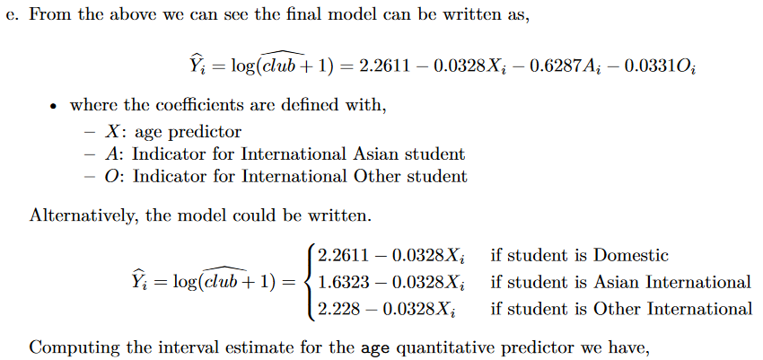

```{r setup, include=FALSE}
knitr::opts_chunk$set(echo = TRUE)
```

# Part 1
## Question 1
### a
```{r}
drink = read.csv("SGTADATASETS/drinking.csv", stringsAsFactors = TRUE, header = TRUE)
par(mfrow = c(1, 3))
plot(club ~ age, data = drink, pch = 20)
mycols = c("blue", "red", "green")
plot(club ~ age, col = mycols[unclass(drink$nat)],
  data = drink, pch = 20)
#legend("topright", title = "Nationality", legend = levels(drink$nat), col = mycols, pch = 20)
legend("topright", title = "Nationality", legend = unique(drink$nat),
  col = mycols, pch = 20)
plot(club ~ age, col = mycols[unclass(drink$sex)],
  data = drink, pch = 20)
#legend("topright", title = "Sex", legend = levels(drink$sex), col = mycols, pch = 20)
legend("topright", title = "Sex", legend = unique(drink$sex),
  col = mycols, pch = 20)
```
All plots seem normal, not sure what comments to make. 

### b
```{r}
club.1 = lm(club ~ age + nat + sex, data = drink)
plot(club.1, which = 1:2)
```
- Normal Quantile plot of residuals: Curvature in the plot indicating right skewness.
– Residual plot: Even though the smoother looks fine, the data itself has strange structure,
with the points trending downwards and some large outliers in the top right of the plot. The
‘grid’ style nature of the plot is due to the data being counts (positive integers or natrual
numbers). This is not ideal for our model.

### c
```{r}
club.2 = lm(log2(club + 1) ~ age + nat + sex, data = drink)
plot(club.2, which = 1:2)
```
– Normal Quantile plot of residuals: Points closer to linear in this case, still some asymmetry
but it is a good improvement from the raw club count response model. The skewness has
been removed and the residuals appear more symmetric and closer to normally distributed.
– Residual plot: The ‘grid’ style is still there but that is a result of the count data. The log
transformed response has removed the large outliers in the residual plot. The variability of
the residuals looks more constant.

### d
```{r}
summary(club.2)

anova(lm(log2(club + 1) ~ age + sex + nat, data = drink))
```
The sex variable appears to be insignificant even after being adjusted for the other variables. The
other variables appear to be significant.

```{r}
club.3 = update(club.2, . ~ . - sex)
summary(club.3)

anova(lm(log2(club + 1) ~ age + nat, data = drink))
```
Both the nat and age variables are significant and we therefore choose this as our final mode.

### e

```{r}
confint(club.3, "age")

TukeyHSD(aov(club.3), "nat")
```
From the multiple comparisons we can see that Domestic students and other international students appear to be similar (insignificant differences). The Asian international students appear to have a lower intercept adjustment than the other nationalities, suggesting they are less likely to go to clubs.
The age predictor appears to show that it has a negative contribution to club visits, that is every
year of a students age will reduce the log(club + 1) response. This quantity is hard to change into
something that can be easily interpreted. Previously we could exponentiate to get back to the original
scale and then look at the ratio. We can’t look at the ratio here directly since the response has been
adjusted with a ‘+1’ as well.


