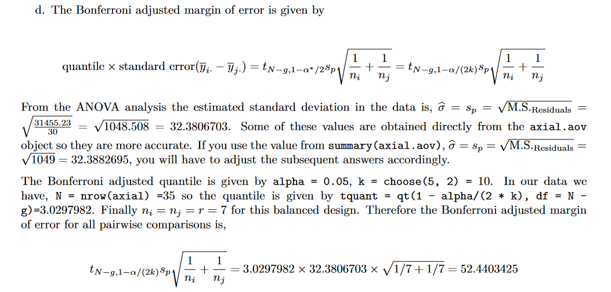

# Part 1
## Question 1
### a
```{r}
axial = read.table('SGTADATASETS/axial.txt', header = TRUE)
str(axial)
head(axial)

axial.aov = aov(asi ~ treatment, data = axial)

#Check assumptions
par(mfrow = c(1,2))
{qqnorm(axial.aov$residuals)
  qqline(axial.aov$residuals)}
boxplot(asi ~ treatment, data = axial)

sd_values <- tapply(axial$asi, axial$treatment, sd)
max(sd_values) / min(sd_values)
bartlett.test(asi ~ treatment, data = axial)
```

### b
```{r}
summary(axial.aov)
```
Since the P-Value is less than the significance level of 0.05 (5%) we have evidence to
reject H0 in favour of H1. That is, we have evidence that the axial stress index is not all the same for
the Plate Levels.

### c
```{r}
TukeyHSD(axial.aov)
```
From the above, 4” metal plate results in a significantly different mean ASI from 10” or
12” plates, both 6” and 8” plates are different from 12” plate respectively, but none of the other pairs
of means studied are significantly different at the 5% level of significance.

### d



